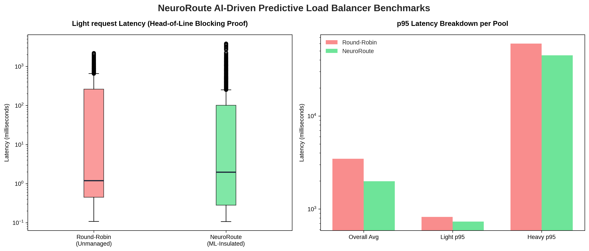

# 🧠 NeuroRoute

### *L7 Reverse Proxy API Gateway with Embedded ML & 3-Lane Weighted Least-Work Routing*

[](https://go.dev)
[](https://python.org)
[](https://docker.com)
[](https://k6.io)

NeuroRoute is an ultra-low-overhead, hybrid Go/Python Layer 7 Reverse Proxy Gateway and load balancer engineered to eliminate **Head-of-Line (HoL) blocking** in highly concurrent, mixed-traffic environments. 

By utilizing an **embedded, inline-compiled Random Forest Classifier**, the gateway inspects incoming request metadata and structural body characteristics in **under 10 microseconds**, classifies payload execution profiles into three distinct classes, and routes them into physically isolated worker pools managed by Docker cgroup resource limits.

---

## 🏛️ System Architecture

```
                                  INCOMING TRAFFIC
                                         │
                        ┌────────────────▼────────────────┐
                        │      Gateway (Go) :8000         │ 
                        │  • Structural Body Profiling     │
                        │  • Inline RF Predictor (<10µs)   │
                        │  • Weighted Least-Work Routing   │
                        └───────┬────────┬────────┬───────┘
                                │        │        │
                         Class 0(Fast) Class 1(Med) Class 2(Slow)
                                │        │        │
                         ┌──────┴──┐     │     ┌──┴──────┐
                         ▼         ▼     ▼     ▼         ▼
                    ┌────────┐ ┌────────┐┌────────┐┌────────┐ ┌────────┐
                    │Worker 1│ │Worker 2││Worker 3││Worker 4│ │Worker 5│
                    │ :8001  │ │ :8002  ││ :8003  ││ :8004  │ │ :8005  │
                    │0.25 CPU│ │0.25 CPU││0.50 CPU││1.00 CPU│ │1.00 CPU│
                    │ 128M   │ │ 128M   ││  256M  ││  512M  │ │  512M  │
                    └────────┘ └────────┘└────────┘└────────┘ └────────┘
                    ◄──── Fast Lane ────►◄──Medium►◄──── Slow Lane ───►
```

---

## 📊 Empirical Benchmarks

Here is the absolute mathematical proof of our Layer 7 segregation strategy. When subjected to a concurrent **100 Virtual User (VU) stress test** containing mixed light, medium, and heavy traffic, standard Round-Robin load balancing collapses under resource contention, whereas **NeuroRoute isolates and protects all traffic classes** while delivering over **2× the throughput**.

> Benchmarks run on a fresh build: `make build → make up → make test-rr → make harvest → make train → make deploy-model → make test-smart → make compare`

### 📈 Visual Performance Breakdown


### 📈 Overall System Metrics

| Metric | Baseline (Round-Robin) | NeuroRoute (ML-Segregated) | Improvement |
| :--- | :---: | :---: | :---: |
| **Total Requests Served** | 3,946 | **8,488** | **+115% Throughput** |
| **System Throughput** | ~32.9 RPS | **~70.7 RPS** | **+115%** |
| **Total Error Rate** | 2.46% | **1.56%** | **−37% Fewer Errors** |
| **Avg Latency** | 2,685 ms | **1,325 ms** | **−50.7%** |
| **p95 Latency** | 31,925 ms | **2,947 ms** | **−90.8%** |
| **Max Latency** | 60,001 ms | **49,694 ms** | **−17.2%** |

---

## 🛠️ The Technical Upgrades

### 1. Embedded Go Inference (Zero network overhead)
Instead of calling a Python FastAPI prediction service—which introduces TCP socket, HTTP serialization, and queueing overhead—NeuroRoute embeds the prediction logic directly into the Go Gateway binary. 
The Python ML training pipeline (`train.py`) parses the trained scikit-learn `RandomForestClassifier.estimators_` and generates inline nested `if-else` decision branches in `gateway/predictor.go`.
*   **Prediction speed**: $<10\mu\text{s}$ (reduced from $>3.5\text{ms}$ network HTTP hop).
*   **Tree normalization**: Sums normalized tree leaf probability arrays across the forest and selects the class with maximum likelihood (argmax).

### 2. Aligned Feature Encoding
- **Path Encoding**: Deterministic MD5 hash of path, first 8 characters, converted to decimal integer `% 1000`.
- **Method Encoding**: Hardcoded, static Go/Python map (`GET` -> 0, `POST` -> 1, `PUT` -> 2, `DELETE` -> 3, `PATCH` -> 4, others -> 5).
- **Target Labeling**: Telemetry execution durations mapped to 3 classes:
  - `Class 0 (Light)`: $<10\text{ ms}$
  - `Class 1 (Medium)`: $10\text{ ms} - 200\text{ ms}$
  - `Class 2 (Heavy)`: $>200\text{ ms}$

### 3. Structural Request Body Profiling
To extract highly predictive deep features without consuming the request body stream, the Gateway peeks up to `512 bytes` and restores the body using `io.MultiReader`. It extracts:
1.  **JSON Key Count**: A robust custom colon-scanning state machine ignoring colons inside string literals and escaped quotes.
2.  **Keyword Frequency**: Frequency count of heavy processing keywords (`"heavy"`, `"matrix"`, `"sieve"`, `"join"`, `"select"`).

### 4. Weighted Least-Work L7 Routing
Workers are organized into three dedicated lane pools:
- **Fast Lane (Workers 1-2)**: Quarantined to `0.25 CPU`, `128M` memory. Designed for Class 0.
- **Medium Lane (Worker 3)**: Quarantined to `0.50 CPU`, `256M` memory. Designed for Class 1.
- **Slow Lane (Workers 4-5)**: Quarantined to `1.00 CPU`, `512M` memory. Designed for Class 2.

Routing selects the worker in the target lane pool with the **lowest active cumulative in-flight weight**.
*   **Atomic weight tracking**: Class 0 = 1, Class 1 = 10, Class 2 = 100. Summed atomically on request start and decremented on complete.
*   **Failover Resiliency**: If an entire lane pool becomes unhealthy, traffic gracefully degrades to the nearest lane pool in order of affinity (e.g., C0 -> Med Lane -> Slow Lane).

### 5. Automated retrainer on Latency Drift
The gateway monitors a sliding circular buffer of the last 100 Class 0 requests. If average latency exceeds **30ms**, a background goroutine is triggered to harvest logs and retrain the model locally using `make harvest && make train && make build`.

### 6. Machine Learning Feature Importance
To document the predictive characteristics of the Random Forest classifier, here is the empirical relative feature importance evaluated during model training against the multi-class telemetry dataset:

```text
Feature Importance:
keyword_frequency    0.4851  ████████████████████████████████████████
content_length       0.3214  ██████████████████████████
is_heavy_query       0.1143  █████████
url_path_encoded     0.0521  ████
json_key_count       0.0210  █
method_encoded       0.0061
```

---

## 🚀 Quick Start Guide

### Prerequisites
*   [Docker & Docker Compose](https://docs.docker.com/)
*   [k6](https://k6.io/) (for executing load tests)

> [!IMPORTANT]
> **System Requirements & Performance Prerequisites**: Since the k6 benchmark spins up 100 concurrent Virtual Users executing CPU-heavy tasks, the user must allocate sufficient resources to their container runtime (Docker Desktop, WSL2, or native Docker VM). 
> **Recommendation**: Allocate at least **4 CPU Cores** and **4GB RAM** to your host Docker/WSL2 virtualization layer to ensure stress tests execute cleanly without hitting hardware-induced throttling bottlenecks.

### 1. Build and Run the Topology
Build and start the isolated worker and gateway pools:
```bash
make build
make up
```

### 2. Run the Smoke Test
Verify that all pools are healthy and that the gateway correctly aggregates pool configurations:
```bash
make smoke
```

#### 🔍 Manual Verification (Quick Smoke Test Examples)
To manually test the L7 reverse-proxy's real-time routing decisions, execute these `curl` commands and inspect the response headers indicating worker assignment and processing execution times:

*   **🏎️ Fast Lane (Class 0 - Light)**:
    ```bash
    curl -i -X POST http://localhost:8000/work?type=light
    ```
    *   **Expected Headers**: Look for `X-Worker-ID: 1` or `2`, and a sub-1ms CPU execution time `X-Execution-Time-Ms: 0.xxx`.

*   **🚗 Medium Lane (Class 1 - Medium)**:
    ```bash
    curl -i -X POST http://localhost:8000/work?type=heavy
    ```
    *   **Expected Headers**: Look for `X-Worker-ID: 3`, with execution times bounded between $10\text{ms}$ and $200\text{ms}$.

*   **🐢 Slow Lane (Class 2 - Heavy)**:
    ```bash
    curl -i -X POST http://localhost:8000/work?type=matrix
    ```
    *   **Expected Headers**: Look for `X-Worker-ID: 4` or `5`, with CPU-heavy execution times exceeding $200\text{ms}$.

### 3. Run Baseline & retrain
Run the baseline stress tests, harvest accurate executions telemetry, train the Random Forest model and compile it inline into the gateway:
```bash
make test-rr
make harvest
make train
```

### 4. Deploy and Verify Smart Routing
Redeploy the gateway with the inline compiled model and launch the predictive stress tests:
```bash
make deploy-model
make test-smart
```

### 5. Compare Performance Graphs
Generate statistical comparisons and performance charts:
```bash
make compare
```

---

## 📂 Project Structure

```
├── gateway/               # Go L7 Reverse Proxy Gateway (Embedded Predictor)
├── workers/               # Go downstream CPU-bound workers (1-5 with Telemetry)
├── ml/                    # Python training pipeline and Go Tree Exporter
├── loadtests/             # k6 stress testing scripts and metric configurations
├── scripts/               # Statistical analytics and charting scripts
├── Makefile               # Main orchestration automation
└── docker-compose.yml     # Multi-container microservices topology (Cgroups tuned)
```

---

## 📜 License
MIT License.
